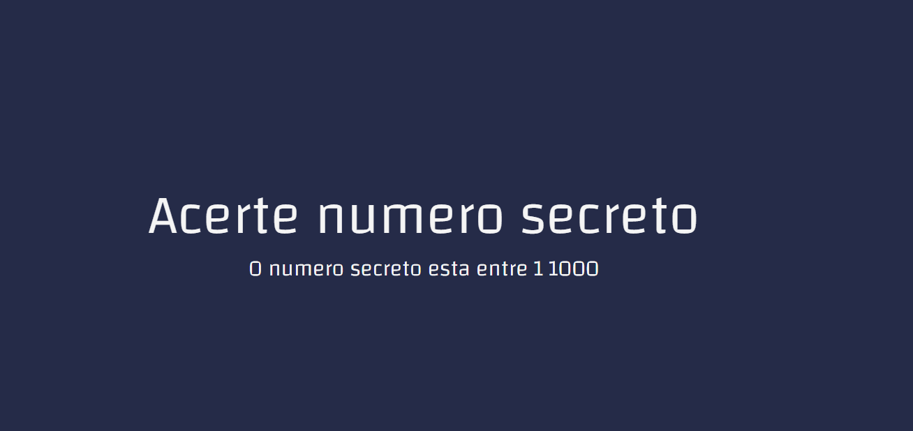

<h1 align="center">
  

  
 <a href="https://asserta-numero-secreto.vercel.app/">JOGO ACERTE O NUMERO SECRETO.</a>
</h1>

<blockquote align="center"> “Faça seu melhor, mas sempre com prazo de entrega!”</blockquote>
 

  ## SOBRE O PROJETO
  

   O projeto do jogo "acerte o numero secreto" funciona da seguinte maneira o sistema sorteia um numero aleatorio entre 1 e 1000
   e voce tem que advinhar por comando de voz, qual o numero que o sistema gerou.
   O sistema vai dando dicas se voce deve falar um numero maior ou menor do que voce falou anteriormente

   A aplicacao funciona somente no GOOGLE CHROME, A API speech-recogntion tem uma melhor perfomance no navegador da google lembr-se de permitir que o NAVEGADOR UTILIZE O SEU MICROFONE.
   

 
 
 
 

  

  

  

    <a href="https://www.linkedin.com/in/deivid-martins1994/">
  	&nbsp;&nbsp;&nbsp;|&nbsp;&nbsp;&nbsp;
  <a href="https://github.com/deivid94">
   &nbsp;&nbsp;&nbsp;|&nbsp;&nbsp;&nbsp;
  <a href="https://www.hackerrank.com/md031194">
   

